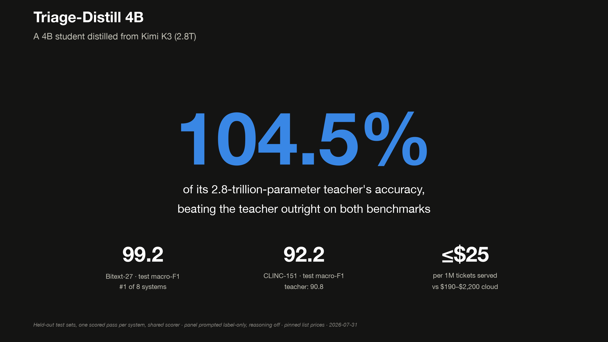
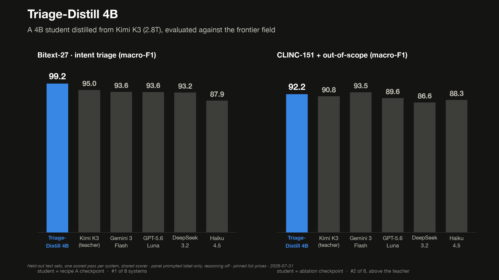
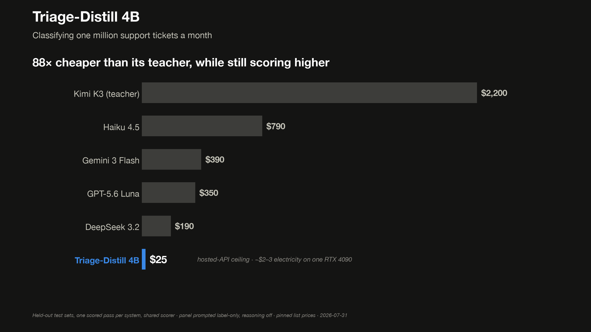

# Triage-Distill

**A 4B model, distilled from Kimi K3, that matches a 2.8-trillion-parameter frontier model on support-ticket triage at about 1% of the cost.**

On a narrow task you pay frontier prices for general ability you never use. A small model, trained on the frontier model's own answers, can buy back almost all of the accuracy for a fraction of the price. This repo proves it with a controlled experiment: the numbers below all come from held-out test sets, each scored exactly once.

<p align="center"></p>

## Results

On the held-out test splits, scored once:

- **99.2 macro-F1 on Bitext-27** (support intents): 1st of 8 systems, ahead of the 2.8T teacher (about 95.0).
- **92.2 macro-F1 on CLINC-151** (real intents): 2nd of 8, behind only Gemini 3 Flash, still ahead of the teacher (about 90.8).
- **About $25 to classify 1,000,000 tickets**, versus $190 to $2,200 for the frontier panel. Roughly 88x cheaper than the teacher, on one owned GPU.

<p align="center"></p>

<p align="center"></p>

Full write-up in [`docs/PAPER.md`](docs/PAPER.md), with plain-language versions in [`PAPER-ELI5.md`](docs/PAPER-ELI5.md) and [`PAPER-UNDERGRAD.md`](docs/PAPER-UNDERGRAD.md).

## How it works

1. **Label.** Run the support tickets through Kimi K3 to get high-quality answers.
2. **Train.** Fine-tune a 4B open model (Qwen3-4B) on those answers with QLoRA, a lightweight fine-tuning method that fits on a single RTX 4090.
3. **Serve.** The 4B model does the whole task in one pass and returns strict, always-valid JSON.

Output per ticket:

```json
{ "category": "get_refund", "priority": "high", "escalate": true }
```

## What's in here

- `src/triage_distill/` - the pipeline: data prep, teacher labeling, training, evaluation, charts.
- `configs/` - pinned model ids and a pricing snapshot, so every cost number is reproducible.
- `artifacts/` - committed results, charts, and release cards. Every number in the paper traces back to a file here.
- `docs/` - the paper and the supporting notes.

## Reproduce

```bash
uv sync
cp .env.example .env      # add your teacher API key (Kimi K3 via OpenRouter or Together)
uv run python -m triage_distill.data.download   # data + frozen label space
uv run python -m triage_distill.data.split      # deterministic train / val / test splits
# training runs on the 4090; see docs/ for the full recipe
uv run python -m triage_distill.eval.render_charts   # regenerate the charts and cards
```

## Reading the results honestly

- The **test split is frozen and scored exactly once**, so nothing is tuned against it.
- The headline rests on **17 training runs** across 3 seeds, 3 recipes, and 2 benchmarks, plus controls.
- "Beats the teacher" comes with a caveat, spelled out in the paper: the teacher is *prompted*, not fine-tuned, so a specialist edging out a generalist on one narrow task is expected. The real result is **matching it at about 1% of the cost**.
- The study also answers a design question: does training on the teacher's step-by-step reasoning, not just its final label, help? Answer: it depends on the data. It helped on the synthetic benchmark and slightly hurt on the real one.

## Compute

- **Dev, labeling, evaluation, charts:** M3 MacBook.
- **Training (QLoRA):** RTX 4090 (24 GB).
