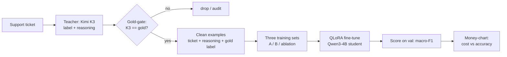

# What we're doing - a plain-English guide

> For someone who knows *what an LLM is* but hasn't met **distillation**, **LoRA**, or **"ablation."**
> Every jargon term is **bolded and defined the first time it shows up**, with a quick-reference glossary at the end.

---

## The one-sentence version

Take a **giant, expensive** AI model, use it to **teach a small, cheap** model to do *one narrow job* -
sorting customer-support messages - almost as well, for roughly **1% of the running cost**. Then prove it
worked with a **controlled experiment**.

That "teach a small model using a big one" move is called **distillation**. The rest of this doc unpacks it.

---

## 1. The job ("the task")

We're building a **classifier**: something that reads a support message and puts it in exactly one bucket.

- **Classification** = choosing one label from a fixed list for each input.
- Our list has **27 intent labels** (`get_refund`, `track_order`, `cancel_order`, …) - this fixed list is the
  **label space**. Every model in the project must use the *same* 27, or the comparison is meaningless.
- The output is compact **JSON** so a program can read it: `{"category": "get_refund"}`.

Example: *"I want my money back for the jacket that never showed up"* → `get_refund`.

*(Later, in Phase 2, we add `priority` and `escalate` fields - but Phase 1, the part we're on, is just `category`.)*

---

## 2. The big idea: knowledge distillation

Think **teacher and student**:

- **Teacher model** = **Kimi K3** - a frontier model with *trillions* of parameters. Very smart, but slow and
  costs real money per message (it runs on someone else's servers, billed per **token** - a token ≈ ¾ of a word).
- **Student model** = **Qwen3-4B** - an open model with ~4 *billion* parameters (~1000× smaller). Runs for
  basically free on a single gaming GPU.

**Knowledge distillation** = using the teacher's outputs as training material to teach the student. The student
learns to imitate the teacher on our narrow task. It won't match the teacher at *everything* - but it doesn't
need to. It only needs to be great at triaging support tickets.

**"Why not just train the student on the correct answers directly?"** - the obvious question, and there are two
real answers:
1. The teacher doesn't just give an answer, it gives its **reasoning** - and that reasoning carries extra signal
   the bare answer doesn't (more on this in Section 5).
2. For the *real* business task (deciding what to **escalate** to a human), there are **no correct answers to
   train on** - nobody labeled them. So a teacher that can generate good labels isn't a shortcut, it's the only
   fuel we have.

---

## 3. Why a small model can keep up: fine-tuning

The student isn't learning from scratch. Qwen3-4B is already **pretrained** - it has read a huge chunk of the
internet and *knows language*. **Pretraining** is the expensive, trillions-of-tokens phase that teaches a model
English, facts, and reasoning in general.

We only do **fine-tuning**: taking that pretrained model and nudging its internal numbers (**weights**) so it's
good at *our* specific task. This is a totally different scale from pretraining - **specializing** an existing
model needs only *thousands* of examples, not trillions of tokens. That's why ~3,000 labeled tickets is enough.

---

## 4. Doing it cheaply: LoRA and QLoRA

A 4-billion-parameter model is still big. Updating *all* its weights (**full fine-tuning**) needs far more GPU
memory than a normal gaming card has. Two tricks fix that:

- **LoRA** (Low-Rank Adaptation): **freeze** the giant pretrained model - don't touch its weights at all - and
  bolt on some **tiny trainable "adapter" matrices** beside it. You train only ~0.1–1% as many numbers. Way less
  memory, and the result is a small adapter file instead of a whole new model.
- **Quantization**: store the frozen model's numbers in **4-bit** precision instead of the usual 16-bit, shrinking
  its memory footprint ~4×. The "Q" in QLoRA.

**QLoRA = 4-bit frozen base model + small LoRA adapters.** Result: a 4B student trains comfortably on one 24 GB
RTX 4090. That's the whole reason "small + cheap" is achievable at home.

---

## 5. The special sauce: rationale distillation

This is the method that makes the project more than "fine-tune on labels," and it has a name in the literature:
**Distilling Step-by-Step**.

When the teacher labels a ticket, we make it also write a short **rationale** (a **reasoning trace**) - *why* it
chose that label:

> *evidence → intent:* "They say 'I want my money back' for an undelivered jacket - a request to obtain a refund."
> *why not alternatives:* "Not `track_order` (they want money, not the package's location)…"

The student then trains on **the reasoning AND the label**, not just the label. The reasoning is *extra teaching
signal* - it shows the student *how* to get to the answer - so the student learns more from each example and
needs **less data** to reach the teacher's level. (Fun aside: K3 is a **reasoning model**, so it already "thinks"
before answering; those internal **reasoning/thinking tokens** are billed as output whether we keep them or not,
so capturing the tidy version is essentially free signal.)

---

## 6. Keeping the training data clean: gold-gating

The teacher isn't perfect - sometimes K3's label is wrong. Luckily our dataset (**Bitext**, a public
customer-support set) comes with **gold labels**: human-provided "official correct answers."

- **Gold labels** = the trusted ground-truth answer for each example.
- **Gold-gating** = *keep K3's reasoning only when K3's answer matches the gold label.* If K3 disagrees with gold,
  its reasoning probably went somewhere wrong, so we throw that example out and keep the gold answer as the
  student's target.

In our actual run: **95.5% of K3's labels matched gold** (2,861 of 2,997 kept). Interestingly, chasing down the
dropped 4.5% showed some are **label noise** - cases where *K3 was arguably right and the dataset was wrong* (e.g.
"when will my parcel arrive" is genuinely more like *track my order* than the dataset's "general delivery time").
So gold-gating doubles as a free audit of the data's quality.

---

## 7. The controlled experiment: three "recipes" and the ablation

Here's the part that turns *"I fine-tuned a model"* into *"I ran a controlled experiment"* - the difference
between a hobby project and a credible result. We train the **same** student, on the **same** data, **three
different ways**, changing only *one thing*: how much reasoning the student sees.

| Run | What the student learns | Question it answers |
|---|---|---|
| **Ablation** (the control) | ticket → label **only** | The baseline: what you get *without* the fancy method. |
| **Recipe B** | ticket → reasoning **then** label | Does reasoning-in-the-output help? |
| **Recipe A** | reasoning and label as *separate tasks* | Can we get the benefit but skip reasoning at run-time for speed? |

- **Ablation** = a term borrowed from experimental science: **remove one ingredient and see what breaks.** Here we
  "ablate" (remove) the reasoning to prove the reasoning was actually doing something. If the reasoning students
  (A/B) **beat** the label-only ablation, we've *demonstrated the method mattered* - not just asserted it. That's
  the answer to a skeptical interviewer's *"how do you know the reasoning helped?"*

---

## 8. How we grade it

We split the data into three piles - a standard, non-negotiable discipline:

- **train** - the student learns from this.
- **val** (validation) - a **held-out** pile we check against *while tuning*, to catch **overfitting**
  (**overfitting** = memorizing the training examples instead of learning the general pattern; it looks great on
  train and fails on anything new).
- **test** - a **sacred** pile scored **exactly once**, at the very end. Peeking at it while tuning would
  secretly leak the answers and inflate the score, so we don't.

The headline metric is **macro-F1**:
- **F1** balances two error types (missing real cases vs. false alarms) into one 0–1 score.
- **Macro** = average the F1 of each of the 27 classes *equally*, so a model can't look good by nailing the
  common classes while ignoring the rare ones. (Plain **accuracy** - % correct - would let it do exactly that.)

**The pass gate** (our definition of success):
1. Student macro-F1 **≥ 97.5% of the teacher's** macro-F1, **and**
2. reasoning students **beat** the ablation, **and**
3. the student is **massively cheaper** to run.

The deliverable is the **"money-chart"**: a scatter plot of **cost (x) vs. accuracy (y)**, with our tiny student
sitting high-and-cheap while the frontier models sit high-and-expensive.

---

## 9. Being honest: does it actually generalize?

Bitext is **synthetic** (templated, slightly artificial), so a model can look better on it than it would on
messy real messages. Two terms:
- **In-distribution** = test data that looks like the training data (easy, flattering).
- **Out-of-distribution (OOD)** = data that looks *different* from training - the real test of **generalization**
  (does the skill transfer, or did it just memorize this dataset's quirks?).

So we keep ourselves honest: tune only on val, score test once, and plan an **OOD probe** (real-phrasing messages)
plus real feedback data in Phase 2. And we frame the comparison fairly - it's **prompted generalists** (frontier
models given instructions) **vs. a fine-tuned specialist** (our student). That's the whole legitimate thesis of
distillation, stated out loud rather than hidden.

---

## The pipeline at a glance

---

## Glossary (quick recap)

| Term | In one line |
|---|---|
| **Distillation** | Teaching a small model using a big model's outputs. |
| **Teacher / Student** | The big source model (Kimi K3) / the small model we train (Qwen3-4B). |
| **Token** | The chunk an LLM reads/writes; ≈ ¾ of a word. Billing is per token. |
| **Pretraining** | The huge, general "learn language" phase (trillions of tokens). |
| **Fine-tuning** | Nudging a pretrained model to be good at one narrow task (thousands of examples). |
| **Weights** | The internal numbers a model learns; training adjusts them. |
| **LoRA** | Freeze the big model, train tiny add-on "adapters" instead - cheap fine-tuning. |
| **Quantization** | Storing weights in fewer bits (4-bit) to save memory. |
| **QLoRA** | 4-bit frozen model + LoRA adapters → fine-tune a 4B model on one gaming GPU. |
| **Rationale / reasoning trace** | The teacher's short explanation of *why* it picked a label. |
| **Reasoning ("thinking") tokens** | A reasoning model's internal step-by-step tokens (billed as output). |
| **Gold labels** | Trusted human ground-truth answers. |
| **Gold-gating** | Keep the teacher's reasoning only when it agrees with the gold label. |
| **Label noise** | Wrong/ambiguous labels in the dataset itself. |
| **Ablation** | Remove one ingredient (the reasoning) to prove it mattered - the control run. |
| **train / val / test** | Learn on / tune against / grade once on. |
| **Held-out** | Data deliberately kept away from training. |
| **Overfitting** | Memorizing training data instead of learning the general pattern. |
| **Macro-F1** | Balanced accuracy averaged equally across all classes (rare ones count). |
| **In-distribution / OOD** | Looks like training data / looks different - the real generalization test. |
| **Generalization** | Whether the skill transfers to new, unseen data. |

---

*Want the deeper version of any section? The full plan is in [`SPEC.md`](../SPEC.md); the mechanics are in the
code under `src/triage_distill/`.*
